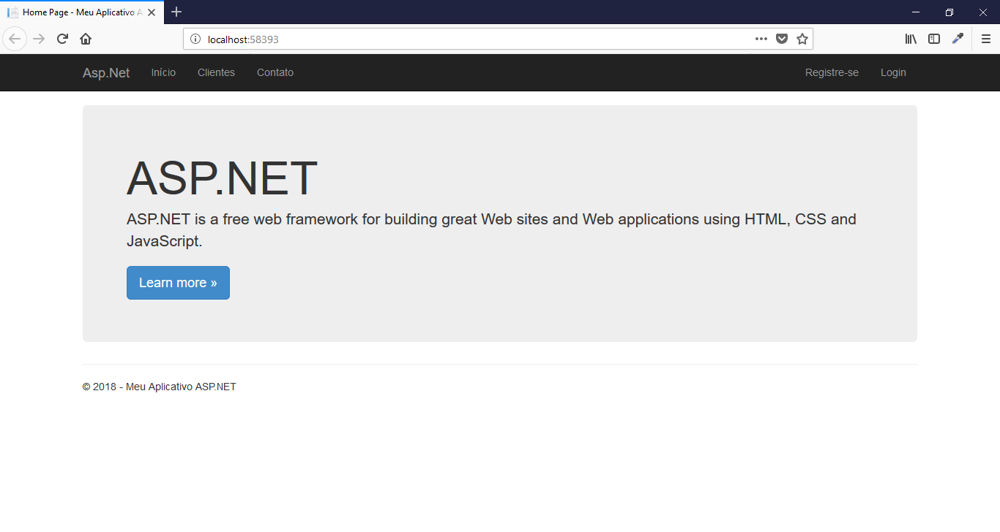
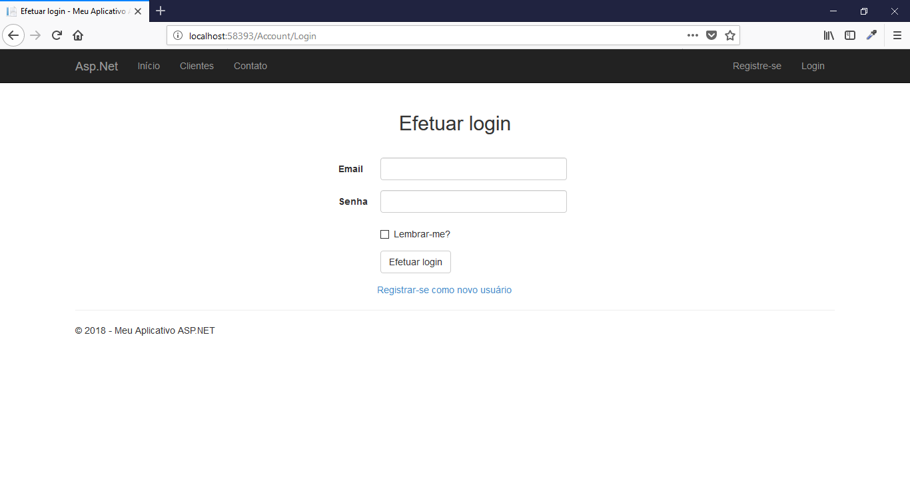
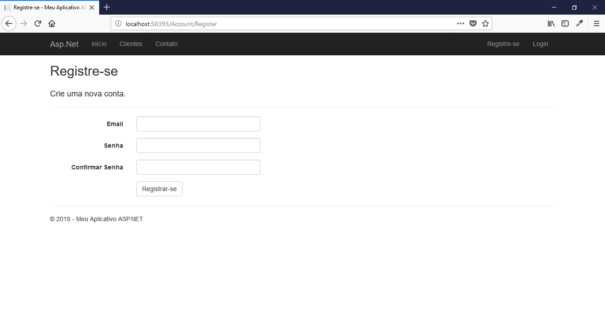
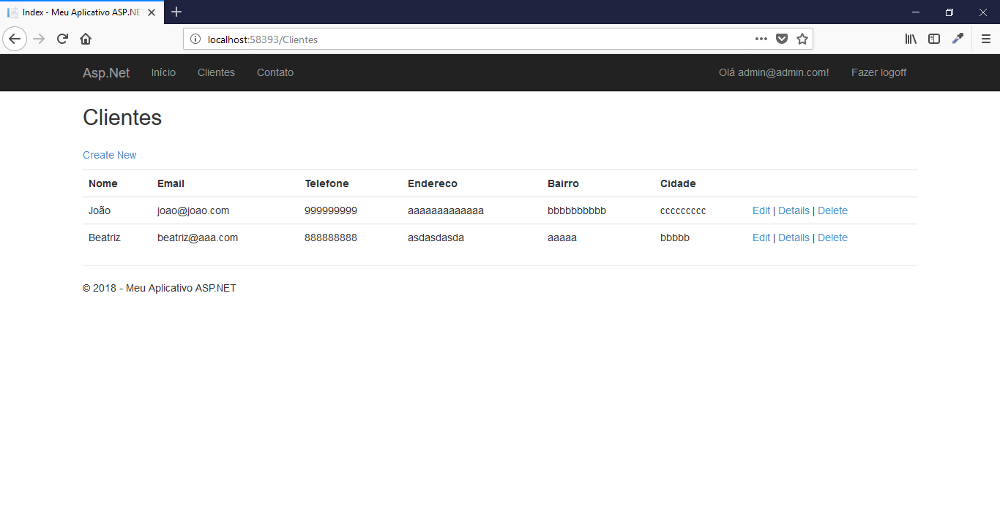
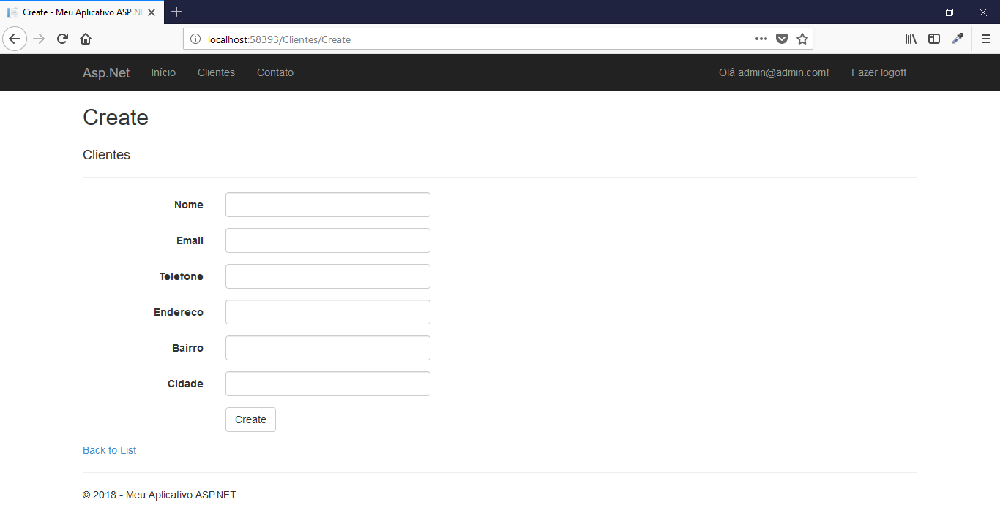

# CRUD Asp.Net

Web application, client registry using Asp.Net Framework 4.6.1 and SQL Server.

## Features

- Autentication
- Routes
- CRUD
- View Cshtml

## Requirements

- IIS
- Microsoft .NET Core SDK
- Microsoft SQL Server Express LocalDB

## Tecnologies

- C# 
- ASP.NET 4.6.1
- JQuery
- Bootstrap
- MSSQL

## Connection

Change the Web.config file according to the connection of your database.

```
  <connectionStrings>
    <add name="DefaultConnection" connectionString="Server=(LocalDb)\MSSQLLocalDB;Database=crudaspnet;User ID=;Password=;Trusted_Connection=False;"
      providerName="System.Data.SqlClient" />
  </connectionStrings>
```

## Demonstration

You can see the system working by clicking the link below:
http://crudaspnet.gearhostpreview.com/

- Login:
	- Email: admin@admin.com
	- Password: #Admin123

## License

Laravel Admin is licensed under <a href="LICENSE">The MIT License (MIT)</a>.

## Screenshots

<br><br>
<br><br>
<br><br>
<br><br>
<br><br>
